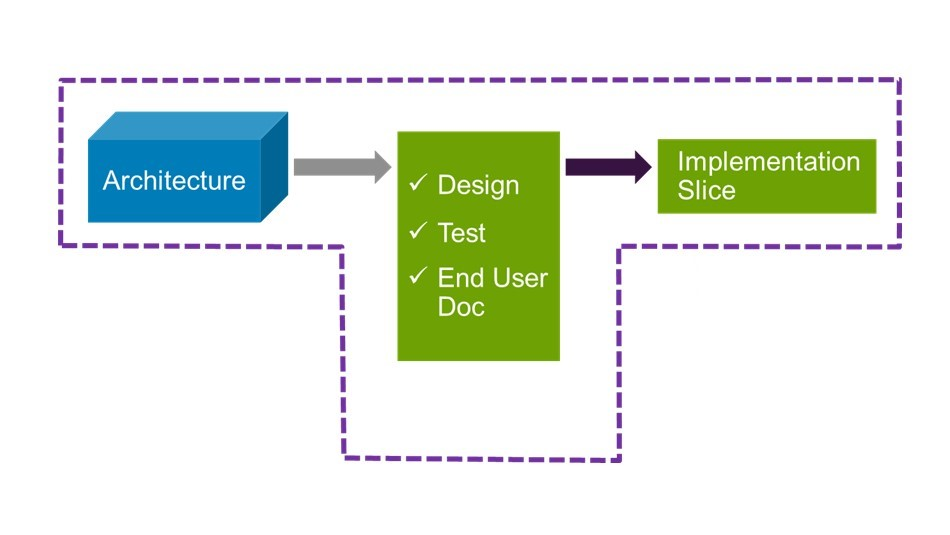

# Contributing

## Development Philosophy

Work in this project is guided by a number of Agile principles and cloud native application development practices.

Develop only what is needed to achieve the goal; make use of concepts, tools
and software that are already available. "Stand on the shoulders of giants".
Make smart choices for dependencies.  Focus on outcomes. Plan with the
objective to close the gap between where the project is and where it needs to
be.  Revisit next steps regularly as the goal becomes clearer and knowledge
more complete.

## T-Model

The T-Model philosphy is a condensed version of few core agile practices that help:
* deliver small increments of work in progress, while
* maintaining known good state

Figure below describes at a high level how this can be accomplished in an agile development environment:

### Architecture

Before starting on a new feature to avoid a lot of confusion during execution, we start with describing a high level architecture.
Note that even the architecture work products can be delivered in increments by keeping in mind few simple principles:
* Architect/Design for Orthogonality
    * Seperation of concerns leading to well defined APIs
    * Enables working in parallel
* Architect/Design for Testability
* Always ask "Is there another way?"
* Follow the DRY (Don't Repeat Yourself) software development principle
* Aim for simplicity

### Design-Document-Test (DDT<->TDD)

To ensure the system is delivering what it was required and architected to deliver, it is recommended that each functional increment introduces a small:
* design change (such as an API),
* provides user facing documentation on how to build, install and use, and
* adds tests (TDD) to validate the functionality being developed in that increment. One can run tests (unit test and
functional test) locally. Tests are repeatable and automated.

## API First

A cloud native application may constitute of multiple microservices.
Different teams may develop services within the application or external groups may use the API to interact with the application.
Hence it is imperative that the contributors have an API first mentality.

In general it is expected APIs are well defined, understood and documented.  Use tools to separate interface and implementation.
This project has used Swagger OpenAPI standard and the tools around it to execute on its API first strategy.

**Learn More** 

* [API First Strategy](https://www.oreilly.com/ideas/an-api-first-approach-for-cloud-native-app-development)
* [Swagger and API first](https://swagger.io/api-first-approach-with-swagger/)

## Continuous Integration

Code is covered by straightforward CI pipeline that includes repeatable steps
such as build, (unit) test and deliver to artifactory.

## Disclaimer

TBD

---

# Project Guidelines

High level processes are in place to implement the software development principles.

[Ocopea Guidelines](guidelines.md)

---

# Source Code

[Ocopea on github](https://github.com/ocopea)

---

# Support Channels

For links to support options, including general discussions on Ocopea, debugging, or entering issues that are encountered:

[Ocopea Support](support.md)

