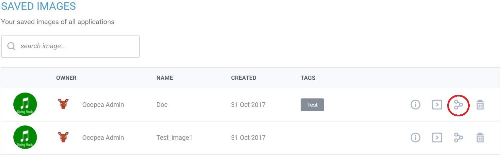
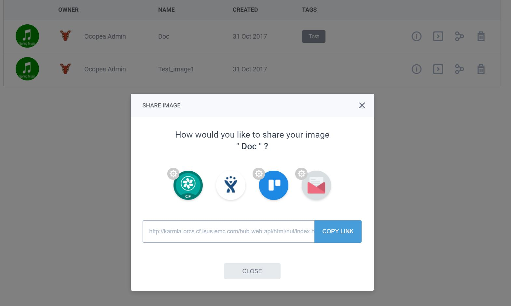
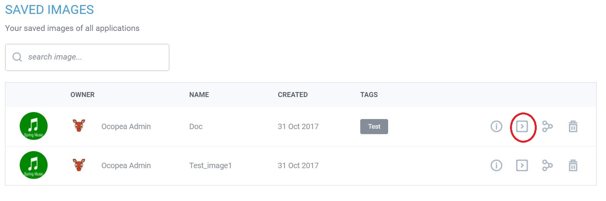

# How To Use

Some examples of Ocopea Use Cases via UI are shown.

## How to make a copy
 1. Open the application instance in Ocopea UI.
 2. Click on "SAVE AS".
 3. In the "Create Image" dialog enter name and tag.
 4. Click on "Save".
 5. To view the images click on the gear button on top right corner, and select "Saved Images". 

## How to file a bug

 1. List the saved images from Ocopea Dashboard, by clicking on the gear button on top right corner, and select "Saved Images".
 2. Select an image by clicking on the share image button.
  
 3. In the "share image" dialog, Select the appropriate bug filing system, e.g. Jira, which should take you to Jira bug tracking system to file a bug.
  

## How to restore a copy

 1. List the saved images from Ocopea Dashboard, by clicking on the gear button on top right corner, and select "Saved Images".
 2. Select an image by clicking on the play button or the button with greater than sign.
  
 3. Configure the app runtime parameters:
 	1. Give it a unique app name.
	2. Select the space to deploy the app. Currently the space should be accessible to the user who deployed Ocopea.
	3. Select service plans by clicking on the service.
	4. Click run.

